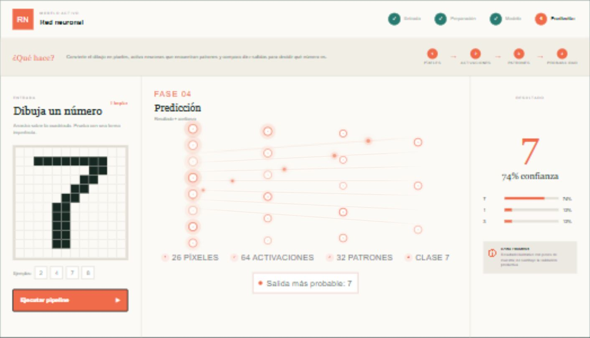

# Laboratorio interactivo de modelos de aprendizaje automático

Aplicación web educativa, reunida en una sola página, para explorar de forma visual cómo tres modelos transforman una entrada en una predicción: **Red Neuronal (RN)**, **Random Forest (RF)** y **Red Neuronal Convolucional (CNN)**.

El laboratorio permite modificar los datos y observar el recorrido completo en cuatro fases:

1. **Entrada:** se recibe un dibujo, un perfil de cliente o una imagen.
2. **Preparación:** los datos se convierten a una representación que el modelo puede procesar.
3. **Modelo:** se visualizan las activaciones, decisiones o rasgos utilizados.
4. **Predicción:** se presenta la clase o nivel de riesgo junto con una medida de confianza.

> Los resultados son ilustrativos y están diseñados para enseñar el funcionamiento de cada modelo. No sustituyen el entrenamiento, la evaluación y la validación necesarios en un sistema productivo.

## 1. Red Neuronal (RN): reconocimiento de números

La primera simulación permite dibujar un número en una cuadrícula de 12 × 12. Cada celda representa un píxel y funciona como una característica de entrada.

### ¿Cómo funciona?

- **Capa de entrada:** recibe los píxeles activos del dibujo.
- **Capas ocultas:** muestran cómo las activaciones avanzan y forman representaciones del patrón.
- **Capa de salida:** compara las posibles clases del 0 al 9.
- **Resultado:** presenta el número más probable y los tres candidatos con mayor confianza.

En esta demostración, el reconocimiento se realiza comparando el dibujo con patrones de referencia. La animación de nodos y señales representa intuitivamente la propagación hacia adelante que realizaría una red neuronal entrenada.



## 2. Random Forest (RF): riesgo de abandono de clientes

Random Forest **no es una red neuronal**. Es un modelo de aprendizaje automático formado por varios árboles de decisión que trabajan como un conjunto o “bosque”.

La simulación analiza cuatro variables de un cliente:

- antigüedad;
- uso mensual;
- cantidad de tickets de soporte;
- gasto mensual.

### ¿Cómo funciona?

- Cada árbol revisa una combinación de variables y toma una decisión independiente.
- Cada decisión se muestra como `SALE` o `SIGUE`.
- Los cinco árboles votan.
- La aplicación combina la votación con el perfil del cliente para estimar el riesgo de abandono.
- Según el porcentaje obtenido, se muestra si el cliente está estable, requiere seguimiento o necesita una intervención prioritaria.

Este modelo resulta útil cuando se desea entender decisiones basadas en reglas y combinar múltiples opiniones para obtener una predicción más estable.


## 3. Red Neuronal Convolucional (CNN): clasificación de animales

Una CNN es un tipo especializado de red neuronal diseñado principalmente para trabajar con imágenes. El usuario puede elegir un ejemplo o cargar una imagen de un gato, perro o ave.

### ¿Cómo funciona?

- **Imagen de entrada:** contiene los píxeles originales.
- **Mapas de rasgos:** las capas convolucionales buscan características como bordes, formas y texturas.
- **Clasificador:** combina los rasgos detectados.
- **Resultado:** muestra la categoría más probable y la distribución entre gato, perro y ave.

La visualización representa conceptualmente el recorrido de una CNN. Las probabilidades de esta versión son valores educativos; para clasificar imágenes reales se debe conectar un modelo entrenado con un conjunto de datos independiente y validado.


## Diferencias entre los modelos

| Modelo | Tipo | Entrada del laboratorio | Idea principal | Resultado |
| --- | --- | --- | --- | --- |
| RN | Red neuronal general | Píxeles de un número dibujado | Propaga activaciones entre capas para reconocer patrones | Dígito y confianza |
| RF | Conjunto de árboles de decisión | Variables de un cliente | Combina las decisiones de varios árboles mediante votación | Riesgo de abandono |
| CNN | Red neuronal especializada | Imagen de un animal | Extrae rasgos espaciales mediante filtros convolucionales | Animal y probabilidades |

La **RN** enseña la comunicación entre capas, **Random Forest** enseña la votación de múltiples árboles y la **CNN** enseña la extracción jerárquica de características visuales.

## Cómo usar el laboratorio

1. Selecciona uno de los tres modelos.
2. Modifica su entrada: dibuja, mueve los controles o carga una imagen.
3. Pulsa **Ejecutar pipeline**.
4. Observa cómo avanzan las fases de entrada, preparación, modelo y predicción.
5. Compara el resultado al cambiar los datos.

## Ejecución local

Requiere Node.js y npm.

```bash
npm install
npm run dev
```

Después, abre [http://localhost:3000](http://localhost:3000).

## Validación

```bash
npm test
```

La validación compila el proyecto y comprueba la estructura principal del laboratorio interactivo.
