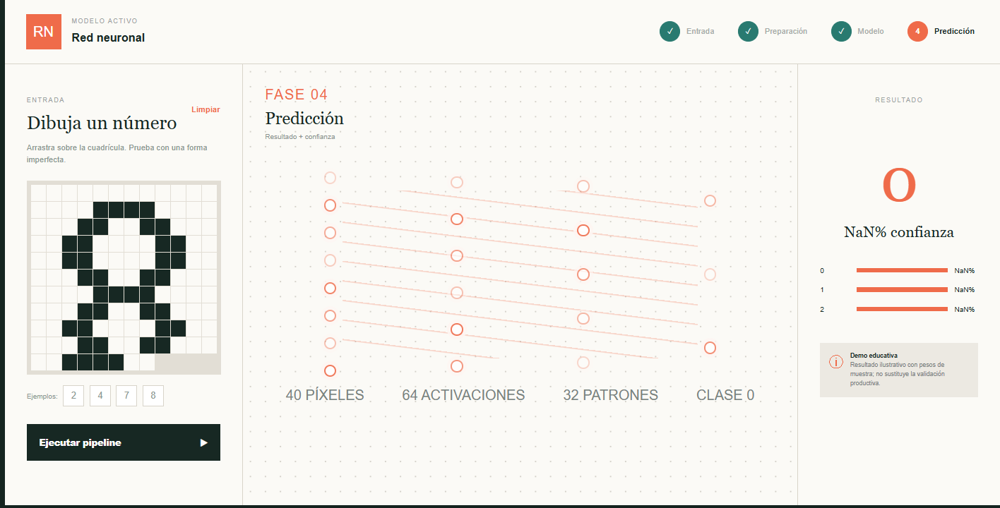
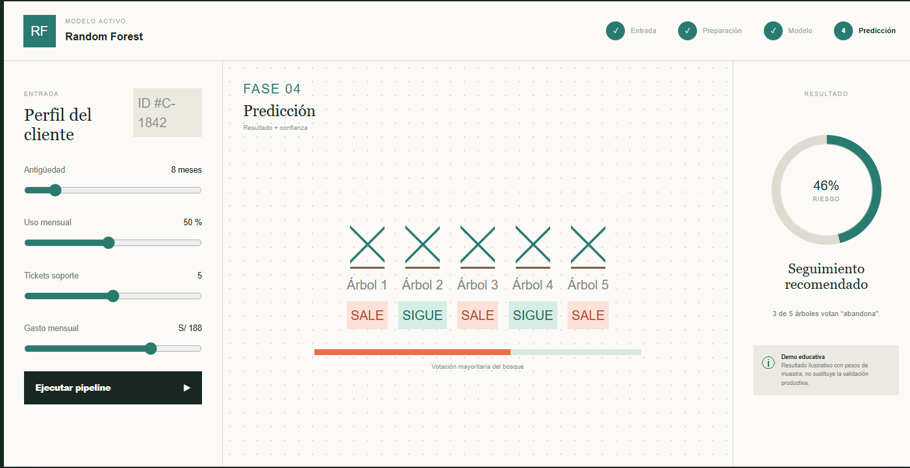
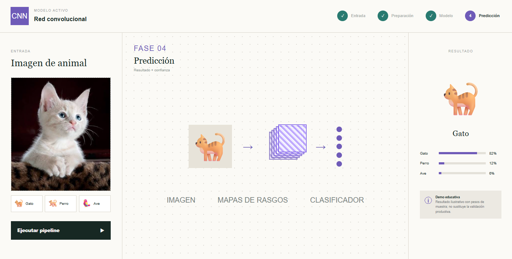

# Simulación básica de modelos

Página única con un laboratorio interactivo para observar, por fases, tres modelos: **Red Neuronal (RN)**, **Random Forest (RF)** y **Red Convolucional (CNN)**.

## 1. Red neuronal: reconocimiento de números

El usuario dibuja un número en una cuadrícula. Cada cuadro funciona como un píxel de entrada; la simulación convierte esos píxeles en activaciones, compara el patrón con los números del 0 al 9 y devuelve los tres candidatos con mayor probabilidad.

La captura original mostraba `NaN% confianza`. Era un error: la probabilidad podía quedar sin un valor válido durante la normalización. Se corrigió calculando pesos finitos, comprobando el total y normalizando los tres resultados para que sumen 100%.



## 2. Random Forest: riesgo de abandono

El usuario modifica antigüedad, uso mensual, tickets de soporte y gasto. Cinco árboles toman decisiones independientes (`SALE` o `SIGUE`) y luego votan. El porcentaje final combina 70% de la votación del bosque y 30% del puntaje de las variables.

También se corrigió una inconsistencia: antes podían votar 3 de 5 árboles por abandono y mostrarse solo 46% de riesgo. Ahora una mayoría de abandono produce un riesgo mayor al 50% y el texto de recomendación coincide con el resultado.



## 3. Red convolucional: clasificación de animales

El usuario sube una imagen o elige un ejemplo. La vista muestra el recorrido conceptual: imagen de entrada, mapas de rasgos, clasificador y probabilidades de gato, perro o ave. Es una demostración educativa; para producción debe conectarse un modelo CNN entrenado y validado con imágenes reales.



## Ejecutar

```bash
npm install
npm run dev
```

Abra `http://localhost:3000`. Todo el contenido visible está reunido en una sola página.

## Validación

```bash
npm test
```

La prueba compila el proyecto y comprueba que la página contenga únicamente el laboratorio interactivo.
